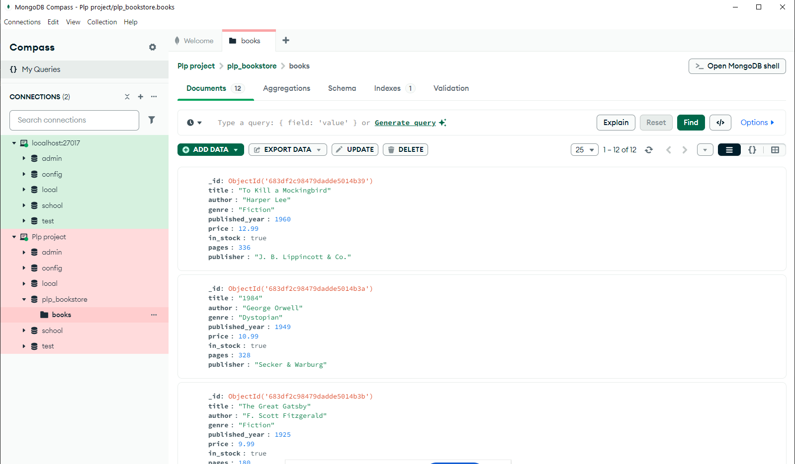

# MongoDB Fundamentals Assignment

## Overview

This repository contains the solutions for the **Week 1: MongoDB Fundamentals Assignment** as part of the MERN Stack course.

## Contents

- MongoDB basics and CRUD operations
- Data modeling and schema design
- Sample queries and aggregation examples

## Getting Started

1. **Clone the repository:**
    ```bash
    git clone https://github.com/PLP-MERN-Stack-Development/week-1-mongodb-fundamentals-assignment-DOMOSH85.git
    ```
2. **Navigate to the project directory:**
    ```bash
    cd week-1-mongodb-fundamentals-assignment
    ```

## Prerequisites

- [Node.js](https://nodejs.org/)
- [MongoDB](https://www.mongodb.com/try/download/community)

## Usage

1. Start your MongoDB server.
2. Follow the instructions in each file to run the queries and scripts.

## Author

- [Ogolla Dancan](https://github.com/DOMOSH85)

## License

This project is licensed under the MIT License.

## Screenshot

